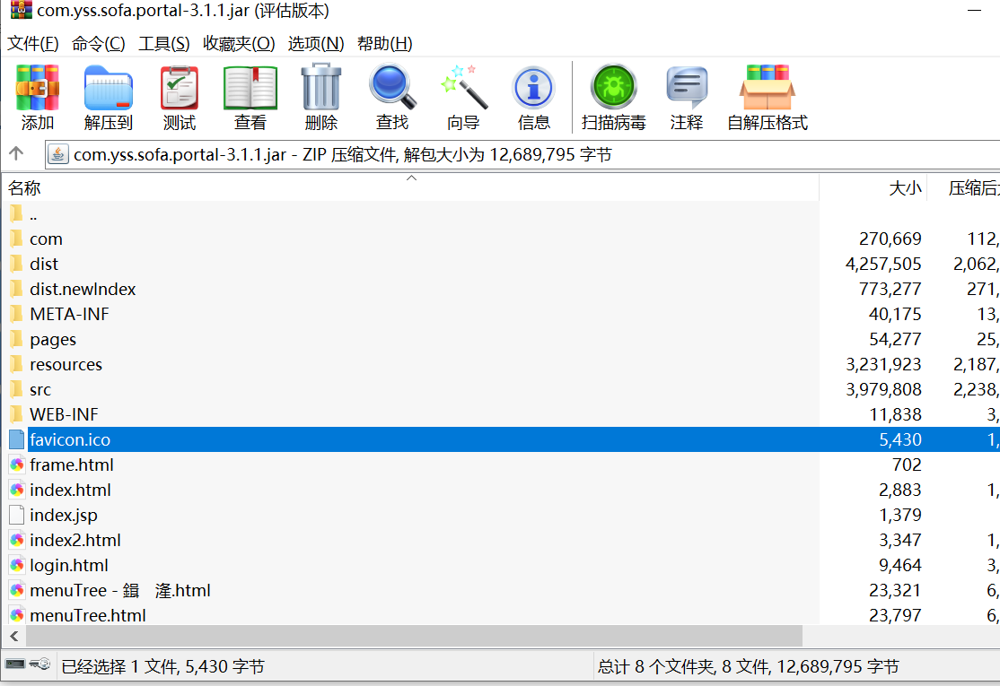

com.yss.sofa.login-3.1.1.jar\pages\default\login.jsp

com.yss.sofa.portal-3.1.1.jar\pages\homepage2.jsp

有portal.extension就改portal.extension里的homepage310.jsp，图标也放里面

<link rel="icon" href="favicon.ico" type="image/x-icon" />

