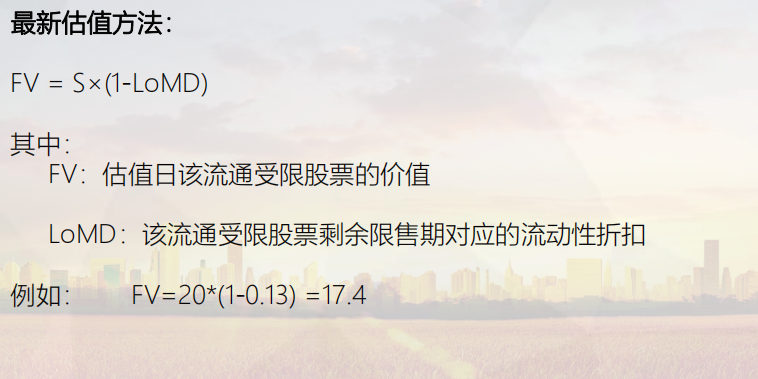

交易

股票的交易是指投资者在市场上对股票进行买卖，交易的场所有上交所，深交所和新三板。

股票的交易规则，包括以下几个方面。

在买卖数量上，最低是一手也就是100股，最高是1万手，100万股。

最小变动单位是0.01元。

竞价撮合的原则是价格优先，时间优先。

涨跌幅限制为10%

交收制度为T+1交收

关于股票的交易程序，首先需要进行开户，一般是在通过券商开户

然后通过网络、电话等形式进行委托

经过交易所撮合成交

然后将数据发送给中登进行登记过户

T+1日资金交收

股票的竞价交易时间，有集合竞价和连续竞价，集合竞价是对一段时间内的申报集中撮合，时间9:15~9:25和14:57~15:00，连续竞价是逐笔连续撮合，时间是9:30~11:30、13:00~14:57。9:15~9:25经过集合竞价产生开盘价，它是以撮合最大的成交数量为原则，买入高于这个价格和卖出低于这个价格的都会成交。14:57~15:00的集合竞价产生收盘价。上交所以前是由一分钟所有交易的成交量加权平均价产生收盘价，后来也改成跟深交所一样由集合竞价产生。

关于股票的交易费用，首先是一级费用，有经手费、证管费、过户费，对于卖方会有印花税，经手费由交易所收取，证管费由证监会收取。过户费由中登收取。由国家税务部门收取。然后二级费用有佣金，由券商收取。费用的计算都是成交金额乘相应的费率，佣金的话一般由券商会承担经手费和证管费，需要扣除。

关于股票交易的接口，上交所的交易数据主要来自于过户库，深交所来自于深交所明细

另外，对于股票需要每天进行估值，所以还需要读取mktdt00.txt中的内容

估值

股票的估值是指通过产品的一些持仓、交易价格等信息，采用相应的估值方法来估算产品的价值，从而帮助投资者判断股票的价值是偏高还是偏低，使他们可以更好地获取收益减少损失。

估值需要公允价值，就是在市场上大家都认可的价值。

那么对于股票，它存在活跃市场，可以使用收盘价进行估值，在一些特殊的情况下也会用其他方法进行估值。

那么从股票的生命周期来看，首先是股票的发行，采用中签价格进行估值。发行之后上市流通，就会有收盘价，采用收盘价进行估值。然后在股票买入时，就直接以成交价格进行估值。

那么股票买入之后，在持有期间可能会进行发放现金股利或者送股，派息后估值价格需要减去每股派息的金额，而送股之后估值价格需要除以(1+送股比例)。

股票可能出现停牌的情况，那么对于短期停牌，价格波动较小的，以最近一日的收盘价进行估值，如果是长期停牌，就需要用指数收益法进行估值。

然后是股票的增发，增发可以分为公开增发和定向增发，一般都是定向增发，并且价格会低于市场价。为了避免对市场产生冲击，会有锁定期，在锁定期内是流动受限的状态，采用流动性折扣法估值。

对于长期停牌的股票，使用指数收益法，因为经过长期的停牌，停牌前的收盘价已经不能反应股票的公允价值。

还有就是对于股票基金，根据指导意见，发生重大事件或者经济环境发生重大变化，使其潜在估值调整对基金资产净值的影响在0.25%以上的，应对估值进行调整并重新确定公允价值。

于是使用指数收益法，用相应的行业指数的收益率作为股票的收益率， 也就是 停牌前收盘价*估值日行业指数/停牌日行业指数 来计算股票的公允价值。

它的优点是可以利用同一个行业的近似属性，获得相对公允的价值，缺点是行业指数无法反映企业自身的一些特点和情况。

以万科A这只股票为例，它在2015年12月19日开始长期停牌，停牌前收盘价为24.43。那么到了2016年6月28日，对持有它的基金进行估值。这只股票的行业指数是AMAC地产，使用停牌前收盘价*估值日行业指数/停牌前行业指数，结果是18.11。那么这个股票价格的变动对基金资产净值的影响也超过了0.25%，确实应该采用指数收益法。

对于流通受限的股票，使用流动性折扣法估值。在旧版的公式将收盘价和初始取得成本的插值均摊到限售期的工作日中，那么这样的方法没有考虑股票价格的波动。在新指导意见中使用了新的公式，用交易所上市的同一股票的公允价值乘*(1-流动性受限股票剩余限售期对应的流动性折扣)

估值

是根据产品持仓、 估值方法等信息，估算产品的价值。帮助投资者发现被低估的股票，或者是判断手中持有的股票是否被高估或低估。

公允价值

亦称公允市价、公允价格。熟悉市场情况的买卖双方在公平交易的条件下和自愿的情况下所确定的价格，或无关联的双方在公平交易的条件下一项资产可以被买卖或者一项负债可以被清偿的成交价格。

股票流通 以当日收盘价估值

股票买入 以成交价格估值

临时停牌 以最近一个交易日的收盘价作为公允价值的计算基础

长期停牌股票的公允价值确定：

条件：当股票发生停牌时，会根据股票对应的行业指数，计算出指数收益法的价格，当按指数收益法调整 后的价格估值，计算出来的公允价值变动金额占前一估值日的基金资产净值占比超过0.25%时

估值价格=最近停牌日期价格*估值日行业的收盘指数/停牌日行业收盘指数

增发

(一) 估值日在证券交易所上市交易的同一股票的收盘价低于非公开发行股票的初始取得成本时，可采用在证券 交易所上市交易的同一股票的收盘价作为估值日该非公开发行股票的价值；

 (二) 估值日在证券交易所上市交易的同一股票的收盘价高于非公开发行股票的初始取得成本时，可按下列公式 确定估值日该非公开发行股票的价值： 

其中：

FV为估值日该非公开发行股票的价值； 

C为该非公开发行股票的初始取得成本；

 P为估值日在证券交易所上市交易的同一股票的收盘价； 

Dr为该非公开发行股票锁定期所含的交易天数；

Dl 为估值日剩余锁定期，即估值日至锁定期结束所含的交易天数（不含估值日当天）。

股票卖出时，直接以卖出成交价估值。

核算：

使用估值所确定的计量模型进行计算，还有产品本身的一些数据计算比如管理费、托管费、销售费计算，TA计算、投资交易费用计算等，并进行复核。

复核

从复核的对象来说，分为：账账核对（托管核对）和账实核对（登记机构核对）