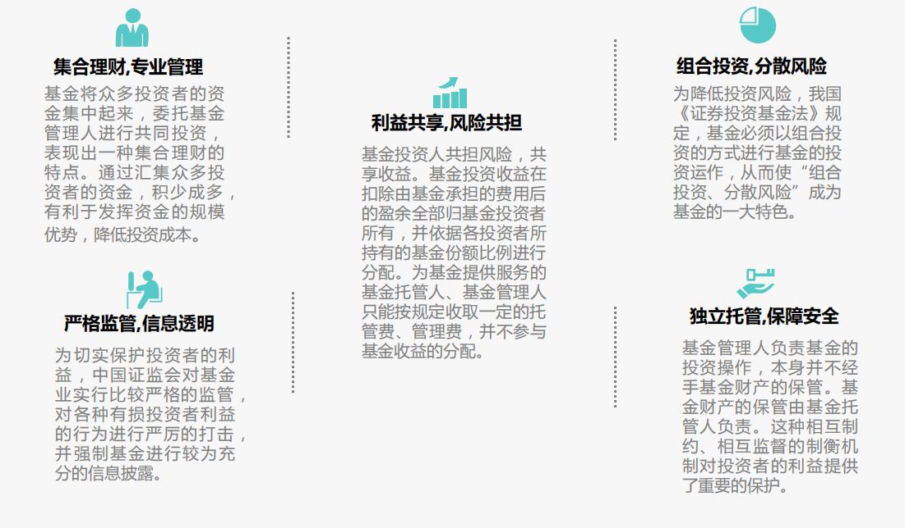
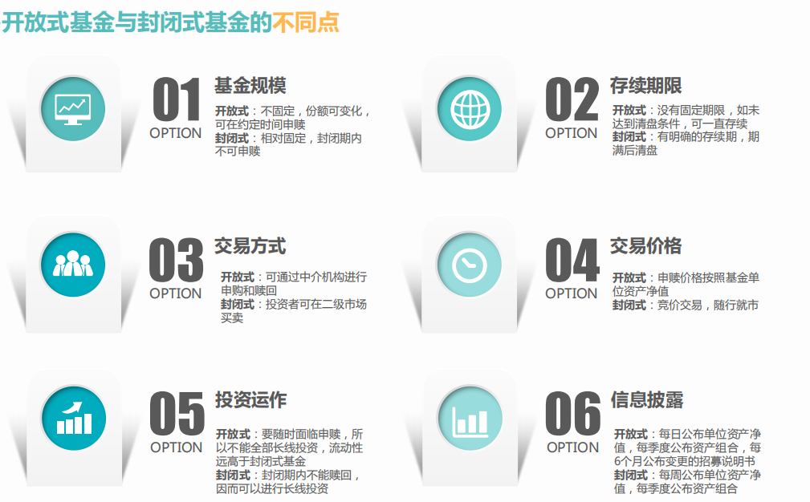
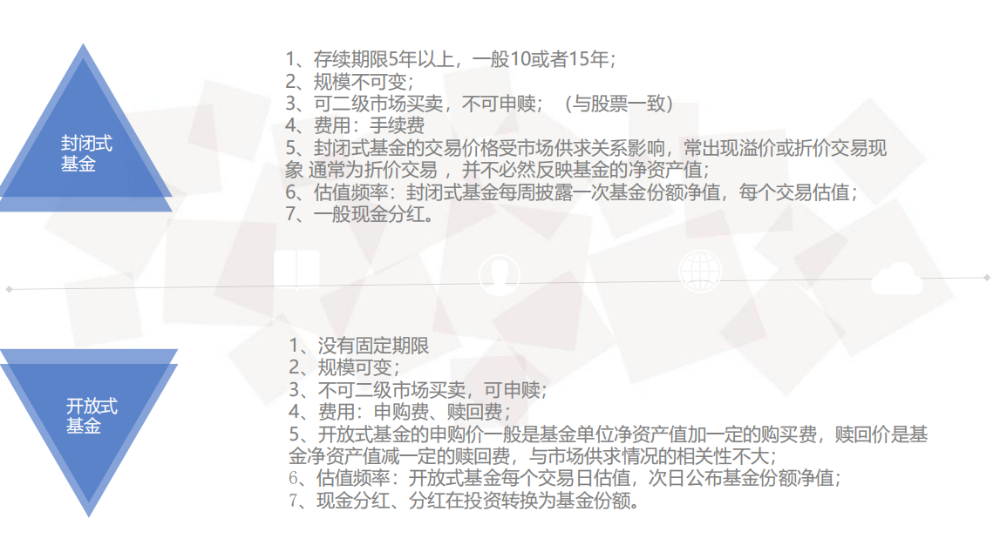
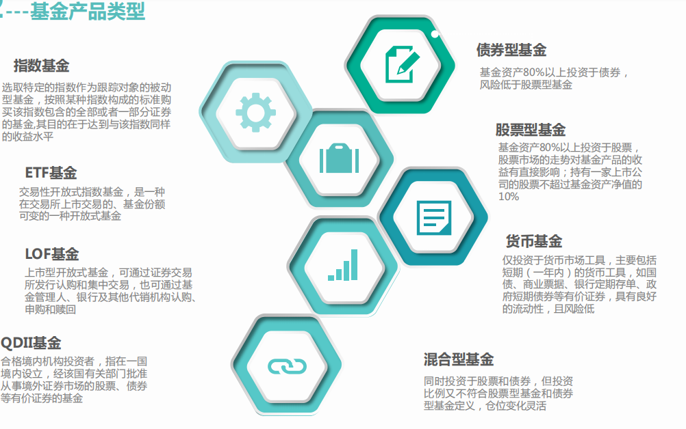

损益平准金指在申购或赎回基金份额时,申购或赎回款项中包含的按未分配基金净收益(或累计基金净损失)占基金净值比例计算的金额。

为什么T+1

日终轧差结算，人行17：00下班

债券买入当天是否计息？

只有DVP T+0计息

托管人模式：托管行和中登做一级结算，托管行和管理人做二级结算

券商模式：中登和券商做一级结算，券商和管理人做二级结算

券商T日扣款，托管人T+1日扣款，和中登都是T+1交收

托管人直连下单

券商委托下单

佣金计算

证券代码	申请编号	成交编号

资产负债表，利润表，所有者权益变动表

到期日

股票：没有

债券：有

基金：封闭式，开放式

募集期清盘：退回资金和利息

运营期清盘：退回资金

货币基金单位净值为1元每份,不会变动.收益以新增份额形式体现.

货币基金无申赎费,只收管理费、托管费和销售服务费(三种费用每天直接净值里扣除,合并在一起也只是一点点,几乎可以忽略不计)。

股票按股东权利分为：

普通股：

优先股：

股债基异同

http://www.chinafund.cn/article/202031/202031_387842.html

https://zhidao.baidu.com/question/1500088025605539419.html

联系

1、三者都是有价证券，都具有有价证券的收益性、流动性、风险性、期限性等特点。它们的投资均为证券投资。　　

2、三者都是虚拟资本。尽管有面值，代表一定的财产价值，但是它们只是一种虚拟资本，它们只是证明投资者和筹资者关系的证书。它们是独立于真正资本之外，在资本市场上进行着独立的价值运动。　　

3、三者的收益率相互影响。从动态上来讲股票收益率的和价格与债券的利率和价格互相影响。具备联动性，一般来说他们都会发生同向的运动，也就是说股票市场上涨，债券市场也会发生上涨，股票市场下跌，债券市场也会发生下跌，但是他们上涨和下跌的幅度相差甚远。指数型基金、股票型基金、混合型基金由于大多数资金是投资股票的，因此股市上涨，这些基金也会上涨，股市下跌，这些基金也会下跌。

　　

股票、债券、基金的区别

1、它们所反映的关系不同。股票反映的是所有权关系，债券反映的是债权、债务关系，而基金放映的则是基金投资者和基金管理人之间的一种委托代理关系。

2、它们所筹资金的投向不同。股票和债券是融资工具筹集的资金主要是投向实业，而基金主要是投向其他有价证券等金融工具。

3、它们的风险水平不同。股票的直接收益取决于发行公司的经营效益，不确定性强，投资于股票有较大的风险。债券的直接收益取决于债券利率，而债券利率一般是事先确定的，投资风险较小。投资基金主要投资于有价证券，而且其投资选择相当灵活多样，从而使基金的收益有可能高于债券，投资风险又可能小于股票。　　

股票涨跌幅

主板10%，科创板、创业板20%，ST、*ST为5%

普通AB股股票（除科创板、创业板）的涨跌幅是10%，如果是*ST或ST股票，涨跌幅是5%。科创板、创业板（核准制+注册制）股票首次公开发行上市的，上市后的前5个交易日不设价格涨跌幅限制，之后的交易日涨跌幅比例设为20%。

属于下列情形之一的，首个交易日无价格涨跌幅限制：

首次公开发行上市的股票和封闭式基金；

增发上市的股票； 

暂停上市后恢复上市的股票； 

退市后重新上市的股票。

https://baike.baidu.com/item/ST%E8%82%A1%E7%A5%A8/632784?fr=aladdin

*ST---公司经营连续三年亏损，退市预警。

ST----公司经营连续二年亏损，特别处理。

股票代码

主板 000、600、601、603以传统产业为主

创业板300 以高科技,高成长的企业为主

科创板688

新三板 全国中小企业股份转让系统 430、830

其他：中小板002，老三板400

1、创业板 创业板的代码是300打头的股票代码；

2、沪市A股 沪市A股的代码是以600、601或603打头；

3、沪市B股 沪市B股的代码是以900打头；

4、深市A股 深市A股的代码是以000打头；

5、中小板 中小板的代码是002打头；

6、深圳B股 深圳B股的代码是以200打头；

7、新股申购 沪市新股申购的代码是以730打头 深市新股申购的代码与深市股票买卖代码一样；

8、配股代码 沪市以700打头，深市以080打头 权证，沪市是580打头 深市是031打头。

9、 400开头的股票是三板市场股票。

蓝筹股 是指长期稳定增长的、大型的、传统工业股及金融股。

网上发行面向全体股民，每个账户有数量限制

网下发行面向机构，没有数量限制

基金费用

认购、申赎：认购费、申购费、赎回费

管理费、托管费、销售服务费，按日计提，按月支付，从基金资产中扣除，T-1的资产净值*费率

交易型：经手费、证管费、佣金

基金特点

担保交收

对于纳入净额提供担保交收的交易品种，中国结算上海分公 司在清算日将当日全部净额担保交收品种的资金清算结果以备付金账户 为单位进行轧差汇总，最终形成结算参与人在交收日净应收或净应付资 金净额。

公司债和企业债的区别

企业债一般由国企，审核制，发改委审核，要求银行或集团担保

公司债由股份公司或者有限公司发行，核准制，证监会审核

公募/私募

200人

公众/特定投资者

管理费/业绩报酬

信息披露：公募严格，私募保密性较强

LOF和ETF区别

ETF是指数基金，是被动型

LOF没有限定，可以是主动也可以是被动

ETF以一篮子股票进行申赎，LOF以现金进行申赎

ETF每15秒公布参考净值

货币基金影子定价：除了摊余成本法估值，还要根据市场利率和交易价格进行估值，如果两者差距太大，需要公告。

债券平台

上交所：竞价交易平台，固定收益平台，大宗商品平台

深交所：竞价，综合协议

债券业务：

发行

交易

权益（派息，还本，兑付

行权（发行者赎回，投资者回售

政策性银行

国家开发银行、中国进出口银行、中国农业发展银行

基金说明书会有什么内容

管理人、托管人、服务机构

运作方式

直销代销机构

投资策略

费用收益分配

估值方法

信息披露

申购赎回

风险揭示

股票费用

经手费0.00487% 

证管费0.002%

过户费0.002%

印花税0.1%

佣金不超过0.3%

公司债、企业债区别

企业债有国企背景，公司债股份公司、有限公司

企业债审核制，发改委审核，公司债核准制，证监会审核

估值表内容：

资产净值、单位净值

净值增长率

本期收益

各类投资合计

实收资本

