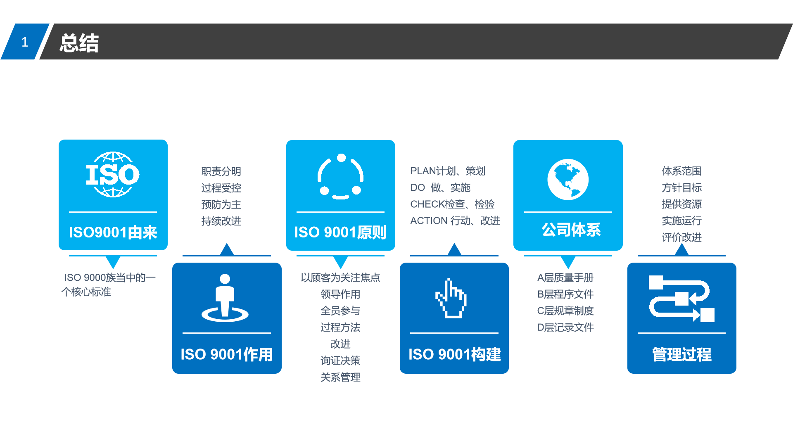

ISO：国际标准化组织

ISO9001：质量管理体系要求

9000：基础和术语

外因：

1.国际经贸组织发展促进国家之间的交流

2.国际产品质量保证和产品责任问题引起普遍关注

3.陷入保出，使出口国提高产品质量

内因：

1.满足市场需求，获取市场信任

2.避免产品缺陷造成事故，巨额的赔偿金

ISO9001作用

职责分明 过程受控 预防为主 持续改进

原则：

体系建设

A层质量手册

B层程序文件

C层规章制度

D层记录文件

