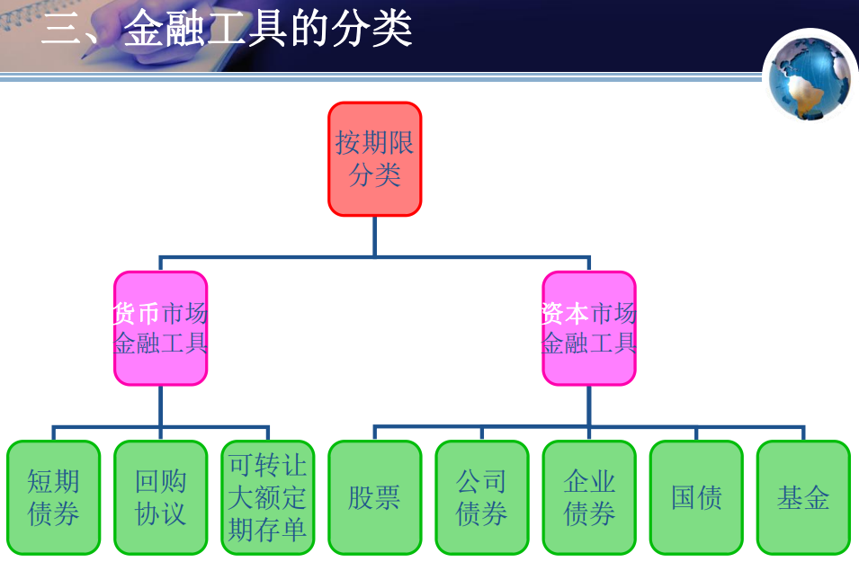

金融工具：在信用活动中产生，能够证明金融交易金额、期限、价格的书面文件。它对于债权债务双方所应承担的义务与享有的权利均有法律约束作用。 

金融工具特征：

1.偿还性 各种金融工具在发行时一般都具有不同的偿还性。 

（偿还性：到期归还。股票、基金没有偿还性，有偿还性的如 债券）

2.流动性 这是指金融资产在转换成货币时，其价值不会蒙受 损失的能力。除货币以外，各种金融资产都存在着不同程度的不完全流动性。

3.安全性 指投资于金融工具的本金是否会遭受损失的风险。 

4.收益性 是指金融工具能定期或不定期给持有人带来收益的特性。

短期债券：偿还期限在1年以下的债券为短期债券 。短期债券的发行者主要是工商企业和政府。 

回购协议：在出售证券的同时，与证券的购买商达成协议，约定在一定期限后按原定价格购回所卖证券，从而获取即时可用资金的一种交易行为 。

可转让大额定期存单：是银行或储蓄机构发行的一种证明文件。它表明有一笔特定数额的资金已经存放在发行存单的机构中，它是从普通的银行存单发展而来的。 

可转让存单则可以在到期日之前拿到货币市场上售出，从而大大提高了存单持有人的资金流动水平。

国债：政府为了筹措资金而向投资者出具的、承诺在一定时期支付利息和到期还本的债务凭证。 

公司债券：公司依照法定程序发行的、约定在一定期限还本付息的有价证券。 

企业债券：指在中华人民共和国境内具有法人资格的企业在境内依照法定程序发行、约定在一定期限内还本付息的有价证券。

股票：是一种有价证券，是股份有限公司签发的证明股东所持股份的凭证，它作为一种所有权凭证，且具有一定的格式。 

基金：全称证券投资基金，指通过公开发售基金份额募集资金，由基金托管人托管，由基金管理人管理和运用资金，为基金份额持有人的利益，以资产组合的方式进行证券投资的一种利益共享 、风险共担的集合投资方式。 