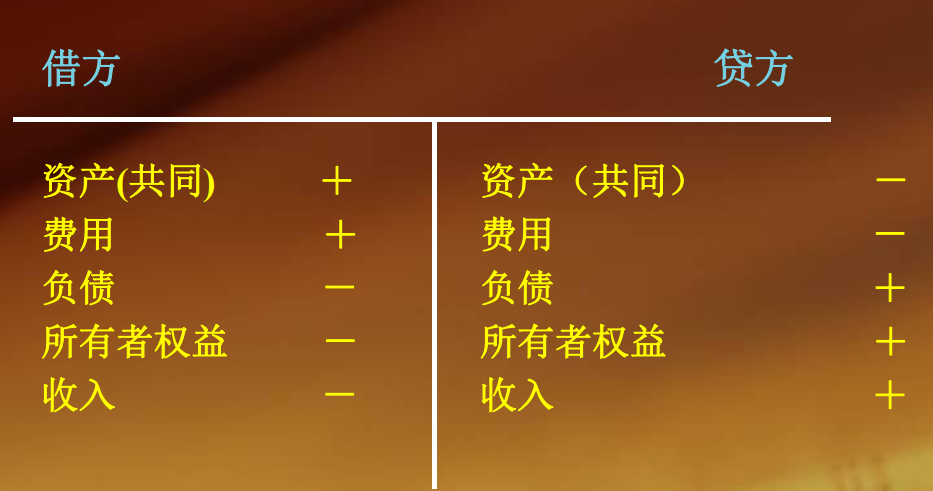

（一）定义 

借贷记账法：复式记账法的一种，通常又全称为借贷复式记账法。

它是以“资产=负债+所有者权益”为理论依据，以 “借”和“贷”为记账符号，以“有借必有贷，借贷必相等” 为记账规则的一种复式记账法。 

（二）借贷记账法的内容 

1.记账符号：借贷记账法为“借”、“贷”二字。 

2.符号含义：表示“增加”或“减少”，但对于五类性质 不同的账户具有不同的含义。 

3.有借必有贷 —— 账户登记方向

4.借贷必相等 —— 账户登记金额

记账符号

