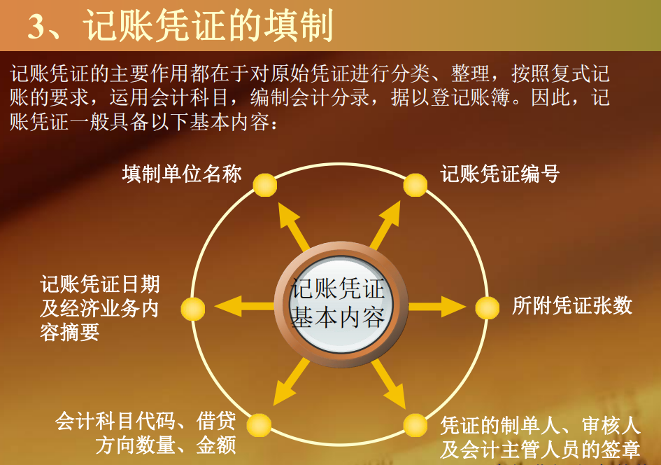

（一）会计分录 

1、定义 会计分录：对某项经济业务标明其应借应贷账户及 其金额的记录，简称分录。 

2、会计分录中的要素 

（1）记账符号：借、贷 

（2）会计科目：如上页例举 

（3）借贷方金额

（二）会计凭证 

1、会计凭证的定义 

会计凭证：是记录经济业务、明确经济责任、按一 定格式编制的据以登记会计账簿的书面证明。用来 记载经济业务的发生，明确经济责任，作为记账依据的书面证明。 

2、会计凭证的分类 

按照会计凭证的填制程序和用途一般可以分为 原始凭证 和 记账凭证 两类。

原始凭证：记录经济业务已经发生、执行或完成， 用以明确经济责任，作为记账依据的最初的书面 证明文件

记账凭证：会计人员根据审核无误的原始凭证或 汇总原始凭证，用来确定经济业务应借、应贷的 会计科目和金额而填制的，作为登记账簿直接依 据的会计凭证。

