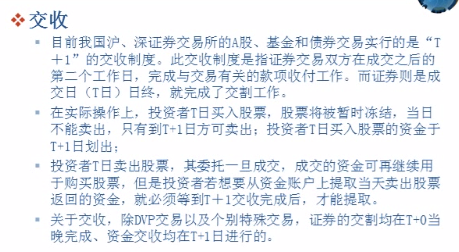

交易品种：

股票； 一手100

基金； 一手100

债券； 一手10张

回购； 

证监会批准的其他品种。 

交易时间：交易日为每周一至周五。 国家法定假日和公告的休市日，休市。 

每个交易日的9:15至9:25为开盘集合竞价时间

9:30 至11:30、13:00至15:00为连续竞价时间 

债券质押式回购9:15至9:25为开盘集合竞价时间

9:30至11:30、13:00至15:30为债券质押式回购的连续竞价时间。

每天的开盘价是上午9：15-9:25集合竞价。深圳收盘价是14：57-15：00的集合竞价，上海是最后一分钟的加权平均价。

