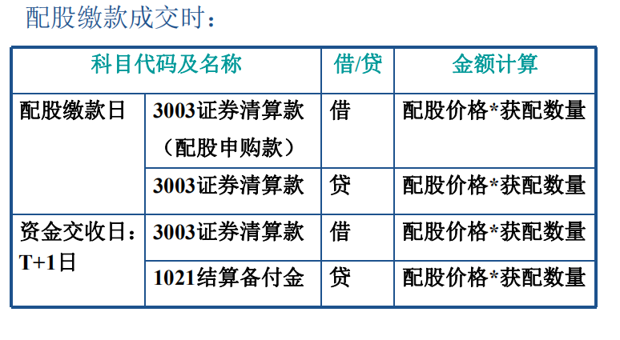
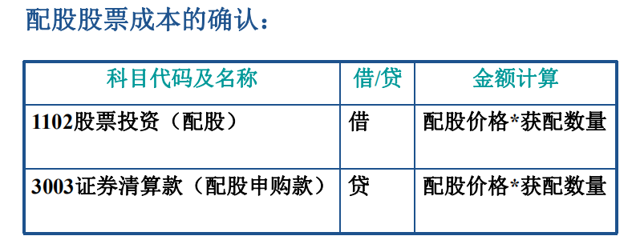
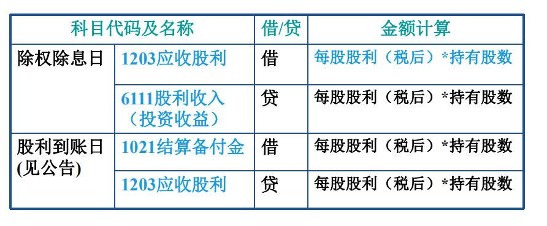
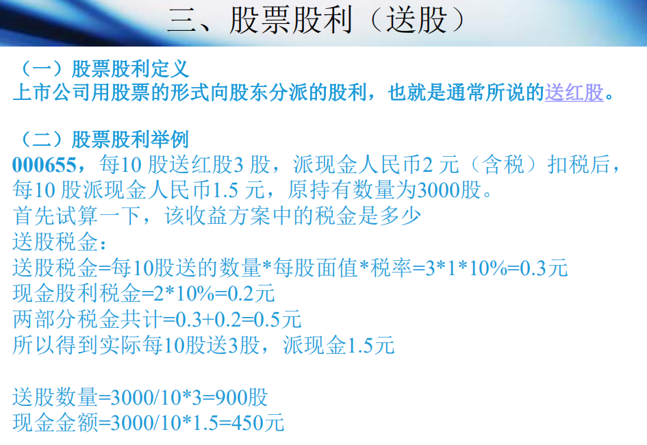
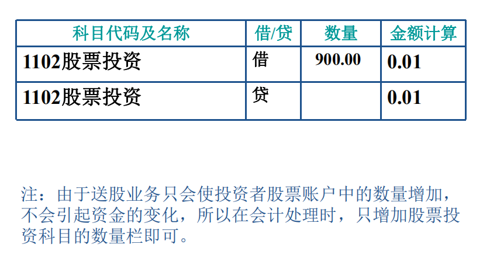

配股：

现金股利

税：

http://www.chinatax.gov.cn/n810341/n810765/n812188/n812925/c1200115/content.html

1、计算公式：应纳个人所得税=应纳税所得额*适用税率=每次收入额*20%2、税收优惠：

（1）个人从公开发行和转让市场取得的上市公司股票，持股期限超过1年的，股息红利所得暂免征收个人所得税；

（2）持股期限在1个月以内（含1个月）的，其股息红利所得全额计入应纳税所得额；

（3）持股期限在1个月以上至1年（含1年）的，暂减按50%计入应纳税所得额。（是应纳税所得额减免）

送股

