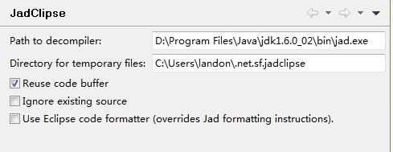
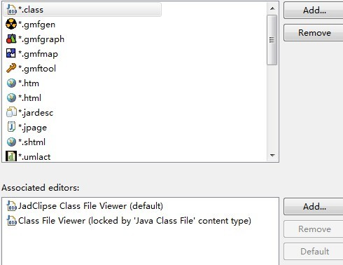

Eclipse反编译工具Jad及插件JadClipse配置

Jad是一个Java的一个反编译工具，是用命令行执行，和通常JDK自带的java，javac命令是一样的。不过因为是控制台运行，所以用起来不太方便。不过幸好有一个eclipse的插件JadClipse，二者结合可以方便的在eclipse中查看class文件的源代码。

下载JadClipse，http://jadclipse.sourceforge.net/wiki/index.php/Main_Page#Download，注意选择与eclipse版本一致的版本

下载Jad，http://www.varaneckas.com/jad，下载相应版本

将下载下来的Jadclipse，如net.sf.jadclipse_3.3.0.jar拷贝到Eclipse下的plugins目录即可。当然也可以用links安装，不过比较麻烦。

将Jad.exe拷贝到JDK安装目录下的bin文件下（方便，与java，javac等常用命令放在一起，可以直接在控制台使用jad命令），我的机器上的目录是D:\Program Files\Java\jdk1.6.0_02\bin\jad.exe

然后，重新启动Eclipse，找到Eclipse->Window->Preferences->Java，此时你会发现会比原来多了一个JadClipse的选项，单击，会出现，如下

decompiler中输入你刚才放置jad.exe的位置，也可以制定临时文件的目录，如图所示。。当然在JadClipse下还有一些子选项，如Debug，Directives等，按照默认配置即可。 基本配置完毕后，我们可以查看一下class文件的默认打开方式，Eclipse->Window->Preferences->General->Editors->File Associations，我们可以看到下图：

我们可以看到class文件的打开方式有两个，JadClipse和Eclipse自带的Class File Viewer，而JadClipse是默认的。 全部配置完成，下面我们可以查看源码了，选择需要查看的类，按F3即可查看源码，如查看Annotation中的Target，使用jad查看