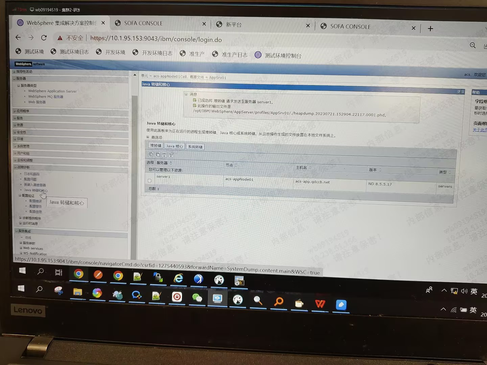

导出，mat分析hprof或phd(需要安装插件)

jmap

https://blog.51cto.com/lookingdream/6082869

was

Java内存分析中常用的两种堆转储文件HPROF和PHD（Portable Heap Dump）在格式、功能及适用场景上有显著差异，以下是两者的核心区别及对应的分析工具：

------

### **一、HPROF与PHD的区别**

1. **格式与来源**
   - **HPROF**：由JVM原生支持的通用堆转储格式，包含完整的堆内存信息（对象类型、大小、引用关系、线程栈、基本数据类型值等）。支持通过JVM参数（如`-agentlib:hprof`）主动生成，或由JProfiler等工具捕获。
   - **PHD**：IBM专有的轻量级堆转储格式，仅记录对象类型、大小及引用关系，不包含对象内部数据或线程信息。通常由IBM JVM生成，文件体积更小，适用于快速分析内存泄漏和基础架构问题。
2. **信息完整性与用途**
   - HPROF文件更全面，适用于深入分析内存泄漏、CPU性能瓶颈及复杂对象引用关系。
   - PHD文件侧重基础内存使用分析，适合初步排查内存问题或资源受限环境下的快速处理。
3. **文件大小**
   - HPROF文件通常与Java堆大小相当，可能达到GB级别。
   - PHD文件体积显著更小，仅保留必要元数据。
4. **生成方式**
   - HPROF可通过JVM启动参数（如`-agentlib:hprof=heap=dump`）或工具（如JProfiler）生成。
   - PHD需在IBM JVM环境下生成，例如通过IBM Diagnostic Tool Framework for Java（DTFJ）。

------

### **二、分析工具推荐**

#### **HPROF文件分析工具**

1. **Eclipse Memory Analyzer (MAT)**
   - 功能：支持HPROF文件的深度分析，提供泄漏检测、对象支配树、直方图等功能。
   - 优势：跨平台，兼容多种JVM生成的HPROF文件。
2. **JProfiler**
   - 功能：实时监控内存并生成HPROF快照，支持堆遍历和CPU分析。
   - 场景：适用于开发阶段的内存优化。
3. **Android Studio HPROF工具**
   - 功能：专为Android优化，可检测Activity泄漏及重复字符串问题，支持转储文件标准化。
4. **hprof-tools工具集**
   - 功能：包含HPROF格式转换（如BMD）、混淆还原（deobfuscator）等扩展功能，适合复杂场景。

#### **PHD文件分析工具**

1. **IBM Memory Analyzer Tool (MAT)**
   - 功能：专为IBM堆转储设计，支持PHD文件的引用链分析和大对象识别。
   - 依赖：需安装DTFJ插件以解析PHD格式。
2. **HeapAnalyzer (HA)**
   - 功能：轻量级工具，快速定位内存泄漏点，适用于IBM WebSphere环境。

------

### **三、选择建议**

- **优先HPROF**：需详细分析内存细节或跨平台兼容时（如Android开发），使用MAT或JProfiler。
- **优先PHD**：在IBM JVM环境中快速排查基础内存问题，选择IBM MAT或HeapAnalyzer。

两种格式均需结合具体场景选择工具，例如混淆后的Android HPROF文件可使用`hprof-tools`的deobfuscator还原，而大型PHD文件需注意MAT的内存配置以避免分析失败。

使用Memory Analyzer （MAT） 分析phd 文件

https://blog.csdn.net/weixin_30544657/article/details/99736754

IBM-MAT

https://www.ibm.com/support/pages/tools-analysing-java-heap-dumps

IBM JDK

https://developer.ibm.com/languages/java/semeru-runtimes/downloads/?version=17

Eclipse Memory Analyzer Tool with DTFJ and IBM Extensions

https://www.ibm.com/support/pages/eclipse-memory-analyzer-tool-dtfj-and-ibm-extensions

