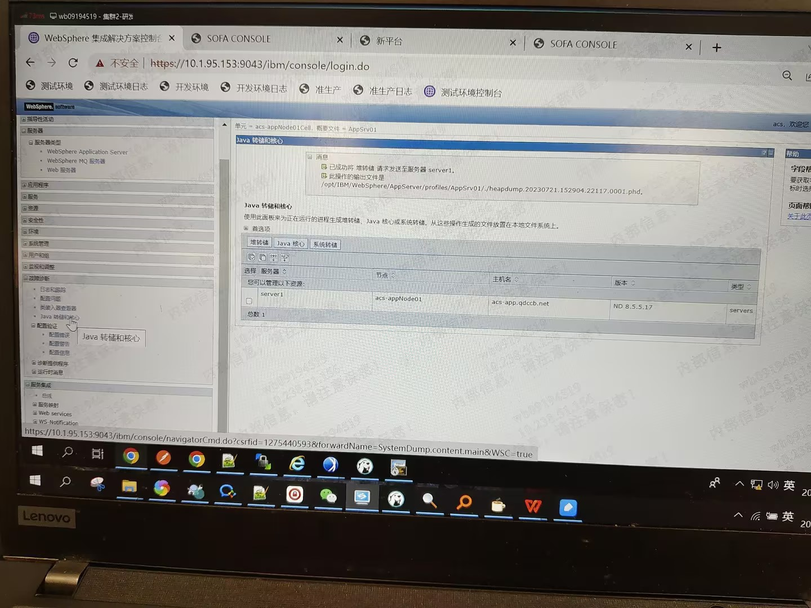

导出，mat分析hprof或phd(需要安装插件)

jmap

https://blog.51cto.com/lookingdream/6082869

was

使用Memory Analyzer （MAT） 分析phd 文件

https://blog.csdn.net/weixin_30544657/article/details/99736754

Eclipse Memory Analyzer Tool with DTFJ and IBM Extensions

https://www.ibm.com/support/pages/eclipse-memory-analyzer-tool-dtfj-and-ibm-extensions

https://www.ibm.com/support/pages/tools-analysing-java-heap-dumps