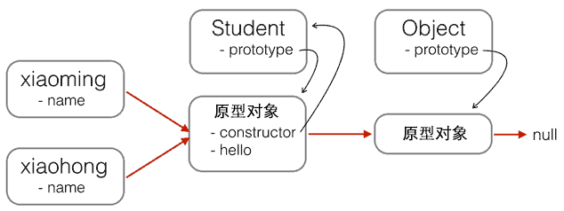

https://www.cnblogs.com/werben/p/11558697.html

https://www.cnblogs.com/loveyaxin/p/11151586.html


instanceof

检查对象原型链是否包含函数的prototype


原型链

Son --> Father --> Object

s

        s._proto_   --> s._proto_._proto_ --> s._proto_._proto_._proto_ --> null

即Son.prototype       Father.prototype         Object.prototype

即       Son                         Father                  Object

```javascript
>var s = new String();
undefined
>s
String {length: 0, [[PrimitiveValue]]: ""}
>s.__proto__
String {length: 0, [[PrimitiveValue]]: ""}anchor: anchor()big: big()blink: blink()bold: bold()charAt: charAt()charCodeAt: charCodeAt()codePointAt: codePointAt()concat: concat()constructor: String()endsWith: endsWith()fixed: fixed()fontcolor: fontcolor()fontsize: fontsize()includes: includes()indexOf: indexOf()italics: italics()lastIndexOf: lastIndexOf()length: 0link: link()localeCompare: localeCompare()match: (f)normalize: normalize()repeat: repeat()replace: (f,e)search: search()slice: slice()small: small()split: (f,e)startsWith: startsWith()strike: strike()sub: sub()substr: substr()substring: substring()sup: sup()toLocaleLowerCase: toLocaleLowerCase()toLocaleUpperCase: toLocaleUpperCase()toLowerCase: toLowerCase()toString: toString()toUpperCase: toUpperCase()trim: trim()trimLeft: trimLeft()trimRight: trimRight()valueOf: valueOf()Symbol(Symbol.iterator): [Symbol.iterator]()__proto__: Object[[PrimitiveValue]]: ""
>s.__proto__===String.prototype
true
>s.__proto__.__proto__
Object {}
```





Object.prototype.__proto__为null


一个新声明的构造函数f，f的prototype为一个Object对象，f.__proto__为一个空函数f.prototype.__proto__为Object.prototype