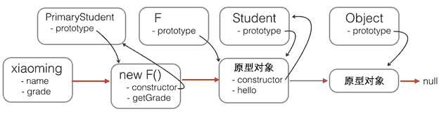

https://developer.mozilla.org/zh-CN/docs/Web/JavaScript/Inheritance_and_the_prototype_chain#%E6%80%BB%E7%BB%93%EF%BC%9A4_%E4%B8%AA%E7%94%A8%E4%BA%8E%E6%8B%93%E5%B1%95%E5%8E%9F%E5%9E%8B%E9%93%BE%E7%9A%84%E6%96%B9%E6%B3%95

https://www.liaoxuefeng.com/wiki/1022910821149312/1023021997355072


```javascript
function inheritPrototype(Child, Parent) {
    Child.prototype = Object.create(Parent.prototype);
    Child.prototype.constructor = Child;
}

function Super(name){
    this.name = name;
    this.colors = ["red","blue","yellow"];
}
Super.prototype.sayName = function(){
    console.log(this.name);
}
function Sub(name){
    Super.call(this,name);//继承属性
}
inheritPrototype(Sub,Super);//继承原型
```


中间函数，不继承构造函数的属性，继承prototype的属性




```javascript
// PrimaryStudent构造函数:
function PrimaryStudent(props) {
    Student.call(this, props);
    this.grade = props.grade || 1;
}

// 空函数F:
function F() {
}

// 把F的原型指向Student.prototype:
F.prototype = Student.prototype;

// 把PrimaryStudent的原型指向一个新的F对象，F对象的原型正好指向Student.prototype:
PrimaryStudent.prototype = new F();

// 把PrimaryStudent原型的构造函数修复为PrimaryStudent:
PrimaryStudent.prototype.constructor = PrimaryStudent;

// 继续在PrimaryStudent原型（就是new F()对象）上定义方法：
PrimaryStudent.prototype.getGrade = function () {
    return this.grade;
};

// 创建xiaoming:
var xiaoming = new PrimaryStudent({
    name: '小明',
    grade: 2
});
xiaoming.name; // '小明'
xiaoming.grade; // 2

// 验证原型:
xiaoming.__proto__ === PrimaryStudent.prototype; // true
xiaoming.__proto__.__proto__ === Student.prototype; // true

// 验证继承关系:
xiaoming instanceof PrimaryStudent; // true
xiaoming instanceof Student; // true
```

封装

```javascript
function inherits(Child, Parent) {
    var F = function () {};
    F.prototype = Parent.prototype;
    Child.prototype = new F();
    Child.prototype.constructor = Child;
}
```


```javascript
function inherits(Child, Parent) {
    //创建空函数
    var F = new Function();
    //空函数原型对象和父类的原型对象进行中转
    F.prototype = Parent.prototype;
    //原型继承
    Child.prototype = new F();
    //还原子类的原型对象构造器
    Child.prototype.constructor = Child;
    //如果有重载时方便子类中方便调用父类方法
    Child.supClass = Parent.prototype; 
    //判断父类的原型对象构造器
    //这里为了防止父类如果定义原型对象时使用 Student.prototype ={...} 的形式时没有设置constructor:Student ，就会使构造器变成了Object.加一层保险
    if (Parent.prototype.constructor == Object.prototype.constuctor) {
      //手动还原父类的原型构造器
      Parent.prototype.constructor = Parent;
  }
}
```

继承，es6 extends翻译

```javascript
"use strict";

function _inherits(subClass, superClass) {
	if (typeof superClass !== "function" && superClass !== null) {
		throw new TypeError("Super expression must either be null or a function");
	}
	Object.defineProperty(subClass, "prototype", {
		value: Object.create(superClass && superClass.prototype, {
			constructor: {
				value: subClass,
				writable: true,
				configurable: true
			}
		}),
		writable: false
	});
	if (superClass) _setPrototypeOf(subClass, superClass);
}

function _setPrototypeOf(o, p) {
	_setPrototypeOf = Object.setPrototypeOf ||
	function _setPrototypeOf(o, p) {
		o.__proto__ = p;
		return o;
	};
	return _setPrototypeOf(o, p);
}

function _createSuper(Derived) {
	var hasNativeReflectConstruct = _isNativeReflectConstruct();
	return function _createSuperInternal() {
		var Super = _getPrototypeOf(Derived),
		result;
		if (hasNativeReflectConstruct) {
			var NewTarget = _getPrototypeOf(this).constructor;
			result = Reflect.construct(Super, arguments, NewTarget);
		} else {
			result = Super.apply(this, arguments);
		}
		return _possibleConstructorReturn(this, result);
	};
}

function _possibleConstructorReturn(self, call) {
	if (call && (typeof call === "object" || typeof call === "function")) {
		return call;
	} else if (call !== void 0) {
		throw new TypeError("Derived constructors may only return object or undefined");
	}
	return _assertThisInitialized(self);
}

function _assertThisInitialized(self) {
	if (self === void 0) {
		throw new ReferenceError("this hasn't been initialised - super() hasn't been called");
	}
	return self;
}

function _isNativeReflectConstruct() {
	if (typeof Reflect === "undefined" || !Reflect.construct) return false;
	if (Reflect.construct.sham) return false;
	if (typeof Proxy === "function") return true;
	try {
		Boolean.prototype.valueOf.call(Reflect.construct(Boolean, [],
		function() {}));
		return true;
	} catch(e) {
		return false;
	}
}

function _getPrototypeOf(o) {
	_getPrototypeOf = Object.setPrototypeOf ? Object.getPrototypeOf: function _getPrototypeOf(o) {
		return o.__proto__ || Object.getPrototypeOf(o);
	};
	return _getPrototypeOf(o);
}

function _defineProperties(target, props) {
	for (var i = 0; i < props.length; i++) {
		var descriptor = props[i];
		descriptor.enumerable = descriptor.enumerable || false;
		descriptor.configurable = true;
		if ("value" in descriptor) descriptor.writable = true;
		Object.defineProperty(target, descriptor.key, descriptor);
	}
}

function _createClass(Constructor, protoProps, staticProps) {
	if (protoProps) _defineProperties(Constructor.prototype, protoProps);
	if (staticProps) _defineProperties(Constructor, staticProps);
	Object.defineProperty(Constructor, "prototype", {
		writable: false
	});
	return Constructor;
}

function _classCallCheck(instance, Constructor) {
	if (! (instance instanceof Constructor)) {
		throw new TypeError("Cannot call a class as a function");
	}
}

function _defineProperty(obj, key, value) {
	if (key in obj) {
		Object.defineProperty(obj, key, {
			value: value,
			enumerable: true,
			configurable: true,
			writable: true
		});
	} else {
		obj[key] = value;
	}
	return obj;
}

var Parent =
/*#__PURE__*/
_createClass(function Parent(name) {
	_classCallCheck(this, Parent);

	_defineProperty(this, "age", 0);

	this.name = name;
});

var Child =
/*#__PURE__*/
function(_Parent) {
	_inherits(Child, _Parent);

	var _super = _createSuper(Child);

	function Child() {
		_classCallCheck(this, Child);

		return _super.apply(this, arguments);
	}

	return _createClass(Child);
} (Parent);
```

