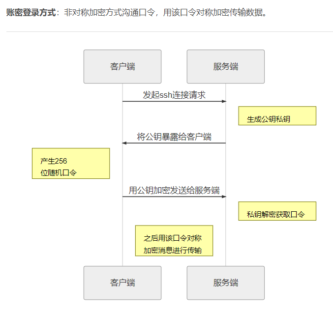
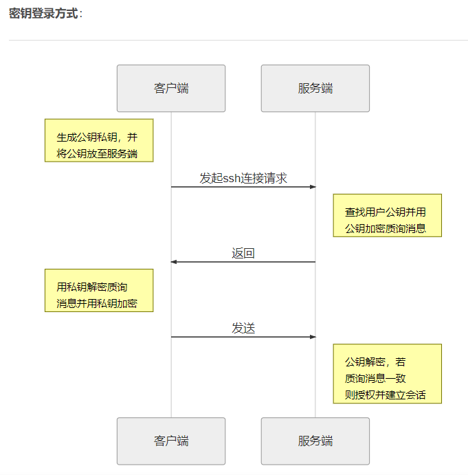

Begin

1.关于对称加密与非对称加密：

对称加密：加密解密使用同一个密钥，即消息发送方与接收方需要协商一个共同的密钥用于消息传输中加解密。

优势：加解密效率高，对计算机要求更低。

劣势： 需要有安全的渠道来协商密钥；无法验证消息发送者的身份；密钥数目增加后管理相当困难（当增加新的消息接收方就需要多一个密钥，而且发送方也需要针对不同人用不同密钥）。

非对称加密：产生一对密钥，分公钥与私钥，如果用公钥加密，则对应的私钥才能解密，如果私钥加密，则对应的公钥才能解密。公钥可以公开传递。消息发送方用接收方的公钥加密消息发送，接收方用自己的私钥解密即可，反之亦然。

优势：无需协商密钥，只需公开分享公钥即可，更为安全。

劣势：加解密效率低，对计算机要求更高。

2.SSH加密方式：

SSH是一种协议，是一种有关如何在网络上构建安全通信的规范。SSH的协议涉及认证、加密、网络上传输数据的完整性。具体而言，SSH具有客户端/服务器（C/S）结构，SSH在计算机之间建立网络连接，并充分保障连接的双方是真实可信的（认证），该连接传输的所有数据不会被窃听（加密），不会被修改（完整）。

生成密钥对：$ ssh-keygen

运行上面的命令后，系统会提示需要确认密钥文件放至路径，

还有要不要对私钥设置口令（passphrase），如果担心私钥的安全，可以设置一个。

命令完成后，在~/.ssh/目录下会生成两个新文件：id_rsa.pub和id_rsa。

前者是你自己的公钥文件，后者是你的私钥文件。

将自己的公钥传到服务器上：$ ssh-copy-id user@ip

/** 上传完之后在服务器上 ~/.ssh/authorized_keys 文件中可以查看到公钥。**/

**或者直接把id_rsa.pub的内容追加到~/.ssh/authorized_keys里**

