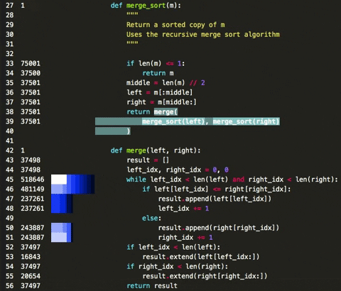
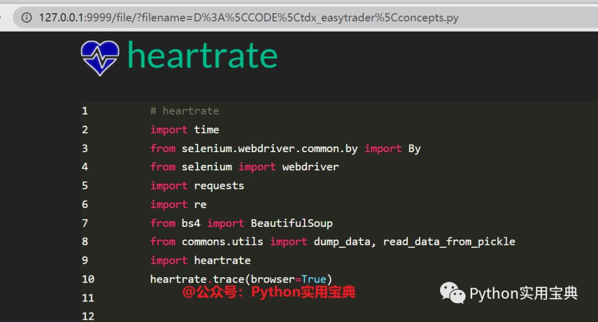
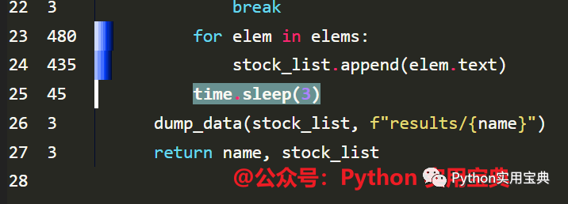

https://www.zhihu.com/question/485980118/answer/2601692002




这个神奇的模块能让你实时可视化地观察Python程序执行时每一行代码的性能表现。

左边的数字是每行被击中的次数。条形显示最近被击中的次数，较长的条意味着其被击中的次数更多。

颜色的深浅代表着命中的时间与当前时间的距离，颜色越浅代表离当前时间越近。

下面就来教大家怎么用这个模块来观察你的代码性能表现。


1.准备


开始之前，你要确保Python和pip已经成功安装在电脑上，如果没有，可以访问这篇文章：超详细Python安装指南 进行安装。

(可选1) 如果你用Python的目的是数据分析，可以直接安装Anaconda：Python数据分析与挖掘好帮手—Anaconda，它内置了Python和pip.

(可选2) 此外，推荐大家用VSCode编辑器，它有许多的优点：Python 编程的最好搭档—VSCode 详细指南。

请选择以下任一种方式输入命令安装依赖：

1. Windows 环境 打开 Cmd (开始-运行-CMD)。

2. MacOS 环境 打开 Terminal (command+空格输入Terminal)。3. 如果你用的是 VSCode编辑器 或 Pycharm，可以直接使用界面下方的Terminal.


```javascript
pip install --user heartrate
```

支持Python3.5及以上版本。


2.基本使用


这个模块用起来超级简单，你只需要在代码里添加下面这两行语句即可：


```javascript
import heartrate
heartrate.trace(browser=True)
```

然后打开浏览器窗口，访问：127.0.0.1:9999

就能看到相关的代码性能表现:



通过Heartrate，我可以很清楚地知道我的代码的瓶颈在哪：



左边柱子越长，说明命中次数越多。

白色柱子越频繁出现，说明该行语句存在非常影响性能的问题。


3.高级用法


除了追踪启动Heartrate程序的文件代码之外，Heartrate还能追踪其他文件的运行情况，如果你的文件引入了其他文件下的函数，它也能一起追踪：


```javascript
from heartrate import trace, files
trace(files=files.path_contains('my_app', 'my_library'))
```

你只需要这么调用即可追踪其他路径下的文件的代码执行情况。

如果你想追踪全部文件：


```javascript
from heartrate import trace, files
trace(files=files.all)
```

这么写即可一劳永逸，不过不建议在生产环境这么用，最好是只用于性能测试。

如果你的代码有性能瓶颈，而你又找不到问题出在哪。那么就快去试一下heartrate，检测到底是哪一行代码出了问题并优化你的代码吧！

我们的文章到此就结束啦，如果你喜欢今天的Python 实战教程，请持续关注Python实用宝典。

原创不易，希望你能在下面点个赞和在看支持我继续创作，谢谢！

点击下方阅读原文可获得更好的阅读体验

Python实用宝典 (http://pythondict.com)

不只是一个宝典

欢迎关注公众号：Python实用宝典

