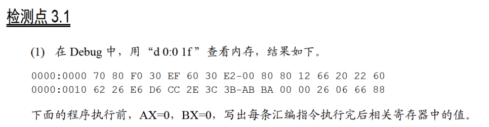
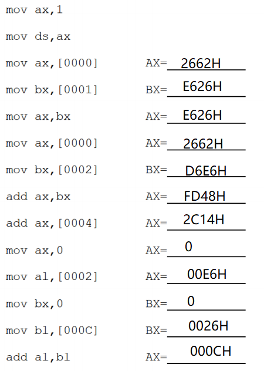
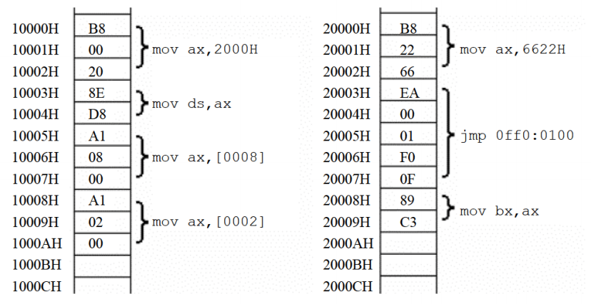
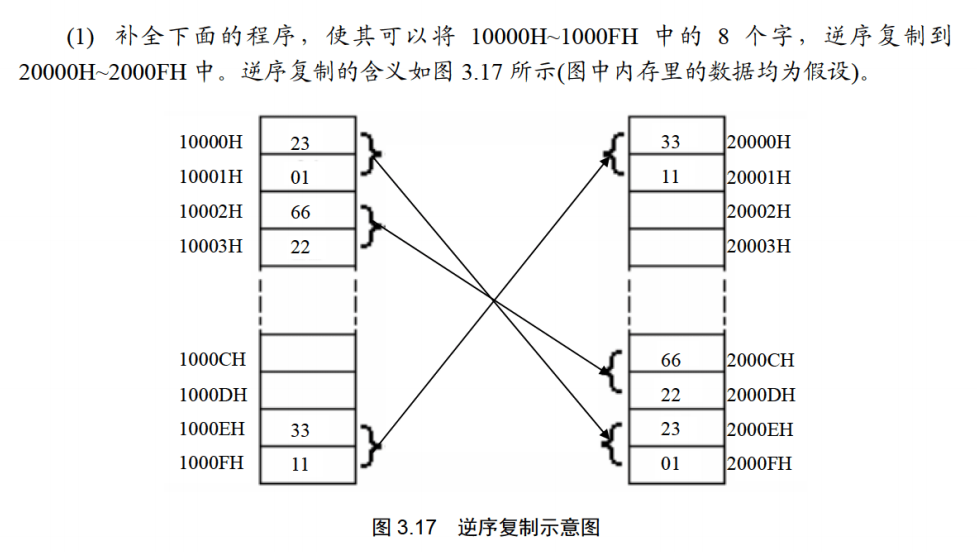

段地址，0001:0000=0000:0010

超出范围取低位


（2）内存中的情况如图3.6所示（图片位于课本P56）。

各寄存器的初始值：CS=2000H，IP=0，DS=1000H，AX=0，BX=0；

1. 写出CPU执行的指令序列（用汇编指令写出）。

1. 写出CPU执行每条指令后，CS、IP和相关寄存器中的数值。

1. 再次体会：数据和程序有区别吗？如何确定内存中的信息哪些是数据，哪些是程序？



mov ax,6622h  ax=6622h

jmp off0:0100(=1000:0)  cs=0ff0,ip=0100

mov ax,2000h  ax=2000h

mov ds,ax  ds=2000h

mov ax,[0008] ax=c389h

mov ax,[0002] ax=ea66h


没有区别，被cs:ip指向时视为指令，被ds:[address]指定时视为数据


3.2




```javascript
mov ax, 1000H
mov dx, ax
______________mov ax,2001H
______________mov ss,ax
______________mov sp,0 ;ss:sp指向20010，即2000F的后一位
push [0]
push [2]
push [4]
push [6]
push [8]
push [A]
push [C]
push [E]
```

（2）补全下面的程序，使其可以将10000H~1000FH中的8个字，逆序复制到20000H~2000FH中。

```javascript
mov ax, 2000H
mov ds, ax
______________mov ax,1000H
______________mov ss,ax
______________mov sp,0
pop [E]
pop [C]
pop [A]
pop [8]
pop [6]
pop [4]
pop [2]
pop [0]
```

