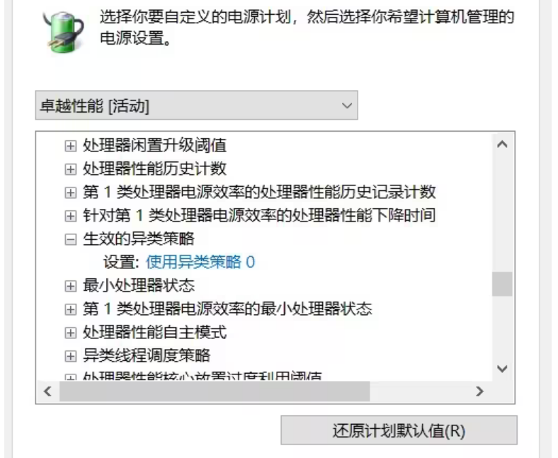
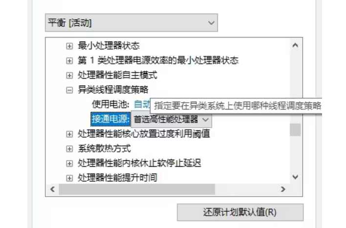
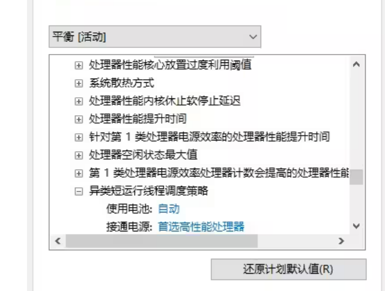

Win10 & Win11 防止12/13代酷睿CPU大核摸鱼的方法！

https://www.bilibili.com/read/cv22214855/

1. 打开注册表 

win+R 打开“运行”，输入regedit ，按回车键

2. 直接在地址栏输入或者找到：

计算机\HKEY_LOCAL_MACHINE\SYSTEM\CurrentControlSet\Control\Power\PowerSettings\54533251-82be-4824-96c1-47b60b740d00

将这个目录下的以下3个子目录里的attributes的值改为2

\# 异类线程调度策略（QoS大小核调度策略）
 93b8b6dc-0698-4d1c-9ee4-0644e900c85d -ATTRIB_HIDE# 

#生效的异类策略（PPM大小核睡眠策略）
7f2f5cfa-f10c-4823-b5e1-e93ae85f46b5 -ATTRIB_HIDE

#异类短运行线程调度策略

bae08b81-2d5e-4688-ad6a-13243356654b

3. 重新打开电源管理，更改高级电源设置：（要修改3处）

展开处理器电源管理

（1）将生效的异类策略 改为“使用异类策略0”（此为修改的第1处）

（2）将两个异类线程调度策略（图①和图②） 都改为“首选高性能处理器”，并确定。（此为修改的另外2处）

①异类线程调度策略

②异类短运行线程调度策略

注：选择“所有处理器”也能实现满核效果，但是并不推荐此选项。因为当程序使用核心数小于CPU物理核心数时，线程是随机提交到大小核的，此时运算效率显著低于“首选高性能处理器”。
