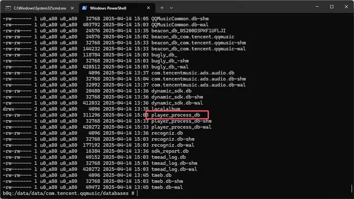
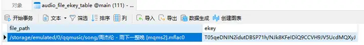
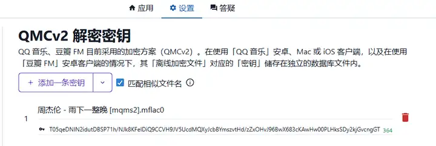
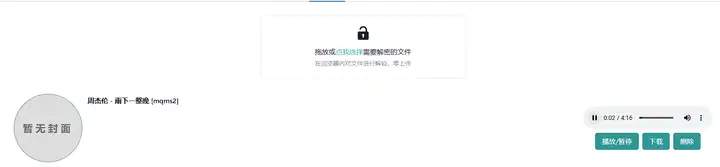

作者：实名用户
链接：https://www.zhihu.com/question/578489042/answer/1895147640515174529
来源：知乎
著作权归作者所有。商业转载请联系作者获得授权，非商业转载请注明出处。

### 现在解起来比较麻烦了，基本不具备实践价值了

QQ音乐换了加密算法，现在的每个文件有独立的密钥，密钥存在/data/data/com.tencent.qqmusic/databses/player_process_db中

访问这个路径的前提是开启了root，然后可以把这个密钥库拷出来，通过[um_react](https://zhida.zhihu.com/search?content_id=722817745&content_type=Answer&match_order=1&q=um_react&zhida_source=entity)项目进行解密

项目地址是 [音乐解锁 - Unlock Music](https://link.zhihu.com/?target=https%3A//um-react.netlify.app/)

在设置中有详细的操作流程，我是通过[adb](https://zhida.zhihu.com/search?content_id=722817745&content_type=Answer&match_order=1&q=adb&zhida_source=entity)连接模拟器导出的文件，以前从来没用过，一路上全是坑，还好把流程跑通了。

这个文件在这里，需要root才能访问这个路径，su后可以将这个文件拷贝到可访问路径例如下载中，然后adb pull导出

然后可以用navicat打开，在[audio_file_ekey_table](https://zhida.zhihu.com/search?content_id=722817745&content_type=Answer&match_order=1&q=audio_file_ekey_table&zhida_source=entity)表中

在设置中添加密钥

就解密成功了

但是流程过于麻烦，已基本不具备实践意义

### 可能会遇到的问题：

- ssh的时候adb: error: failed to get feature set: more than one device/emulator

可能有多个设备 需要-s指定设备, 例如我是[bluestace](https://zhida.zhihu.com/search?content_id=722817745&content_type=Answer&match_order=1&q=bluestace&zhida_source=entity) 5555端口 就要这样 adb -s localhost:5555

- pull的时候没权限

只能拷到不需要权限的文件夹。我没找到别的方法。例如/Download /sdcard

- pull出来0kb

跟上面一个问题

adb的下载地址：[SDK 平台工具版本说明  |  Android Studio  |  Android Developers](https://link.zhihu.com/?target=https%3A//developer.android.google.cn/tools/releases/platform-tools%3Fhl%3Dzh-cn) 这是google官方地址

参考链接：[QQ音乐 qmc/qmcflac/qmcogg/tkm/mgg/mflac新版加密 STag 降级解密音乐格式 - 飘在云端](https://link.zhihu.com/?target=https%3A//www.0z.gs/android/2122.html)

### 就酱~！