https://zhuanlan.zhihu.com/p/31289664

虽然早已跨入了锂电池的时代，镍氢电池似乎已经成为了时代的眼泪。不过大家生活中仍然充斥着各种5号/7号电池的需求，长期买干电池不划算、不环保，买镍氢电池又被童年四驱车的黑暗阴影所笼罩。其实镍氢电池经过了多年发展，已经成功革新了产品世代，现在大部分高性能镍氢电池早已不是当初那个充电慢、掉电快如闪电、天冷就没法用的老镍氢电池了。

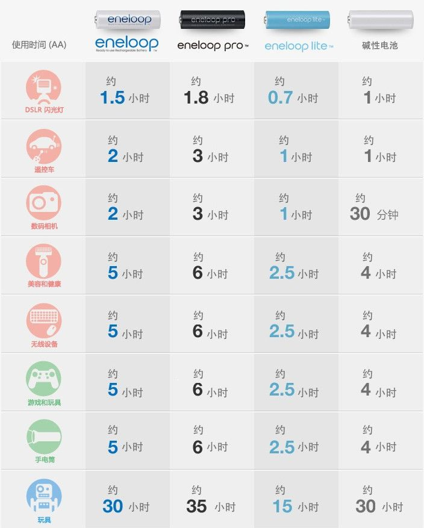

以爱乐普、EVOLTA为首的新一代镍氢电池量产，正式宣告了二代镍氢电池的诞生。新一代的镍氢电池成功克服了前代镍氢电池的短板，成功实现了快充、低自放电、恶劣环境使用等功能。并得到丰田混动汽车的实践运行。从二代镍氢的技术性能来看，除了能量密度不如锂电池外，其他方面已经追平甚至是超越，尤其是循环寿命能够轻松做到锂电池的3倍以上！

新一代的镍氢电池技术的变革证明了镍氢电池并不是落后的电池技术，但是市面上的镍氢电池品牌花样繁杂难以选择，且滥竽充数的不在少数！并非所有的镍氢电池都是那么好用和高性价比，所以我希望能用这篇文章给大家提供或多或少的帮助~

---

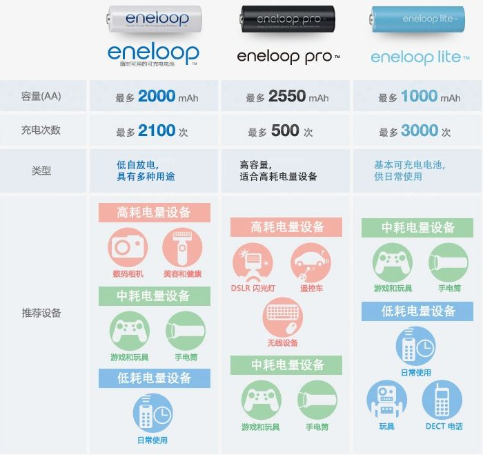

1.爱乐普eneloop

首先第一个推荐的就是爱乐普电池，这是目前公认的最优秀的民用镍氢电池品牌，低自放电镍氢电池的开创者。原是三洋电机下属企业，后因为松下收购三洋案后受美国、欧盟及中国的反垄断调查，爱乐普品牌被拆分。

品牌被松下持有，但是其镍氢技术及生产工厂在富士通旗下！

所以选购时一定要认准，只有日本的FDK株式会社生产的才是真正的爱乐普电池！

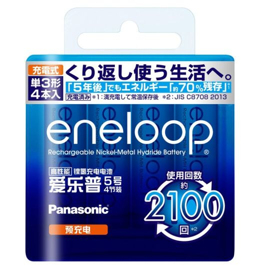

爱乐普3MCCA

爱乐普最经典的镍氢电池—第4代白皮爱乐普：额定1900毫安时、超低自放电、循环次数2100次、日本FDK生产，全球知名度最高的一款镍氢电池！

单节电量相当于620毫安时锂电池（两者因为电压不同不能直接对比毫安时）

目前京东价格30元/节

性能指数：9/10分（镍氢民用之冠）

性价比指数：6/10分

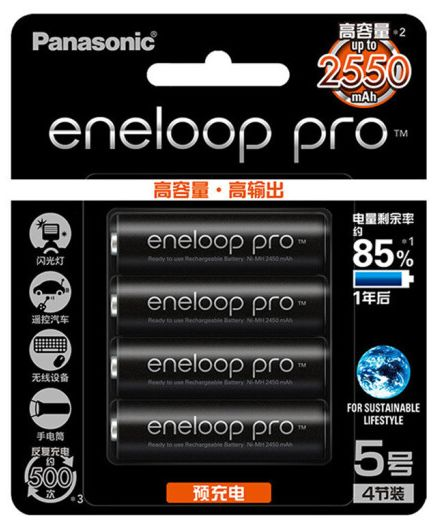

爱乐普3HCCA

白皮爱乐普的容量升级版：额定2450毫安时、自放电不如白皮、循环次数500次、日本FDK生产，名义上的“PRO”实际不如白皮爱乐普畅销，闪光灯必备电池~

单节电量相当于800毫安时锂电池

目前京东价格26.25元/节

性能指数：8/10分

性价比指数：6/10分

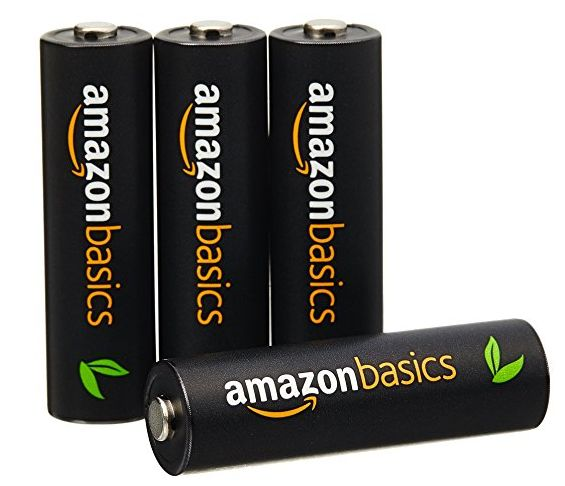

亚马逊倍思（黑皮）

爱乐普黑皮的轻微缩水版：额定2400毫安时、同爱乐普黑皮自放电、循环次数500次，日本FDK生产，用途同上，不太适用于小电量电器上~

单节电量相当于800毫安时锂电池

目前亚马逊价格17.25元/节

性能指数：7.5/10分

性价比指数：8/10分（推荐）

PS：别买白皮亚马逊倍思！BYD代工，性能严重缩水。

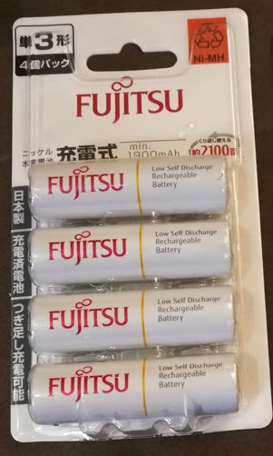

富士通HR-3UTC

标准第4代爱乐普白皮换壳版且没有任何缩水：规格等同第4代白皮爱乐普、日本FDK生产。

单节电量相当于620毫安时锂电池

淘宝价格+运费14.75元/节（国内有正式代理商上海拓影）

性能指数：9/10分

性价比指数：10/10分（强烈推荐）

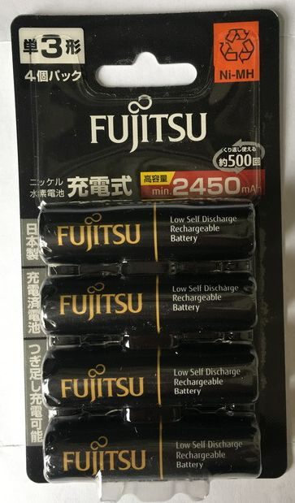

富士通HR-3UTHC

标准第4代爱乐普黑皮换壳版且没有任何缩水：规格等同第4代黑皮爱乐普、日本FDK生产。

单节电量相当于800毫安时锂电池

淘宝价格+运费15.75元/节

性能指数：8/10分

性价比指数：8/10分（虽然性价比高，我还是宁可买黑皮亚马逊）

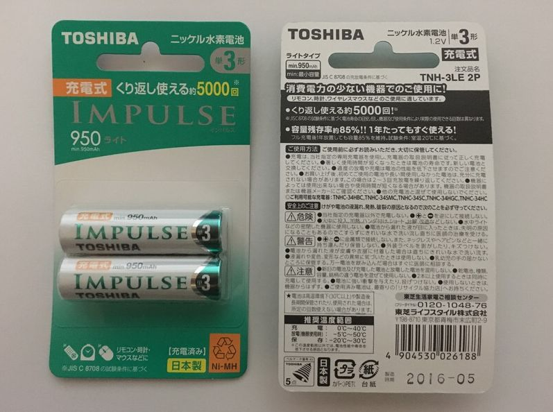

东芝 IMPULSE（轻量）

国内唯一能买到的真eneloop lite：额定950毫安时、与爱乐普黑皮相同自放电、循环次数5000次！日本FDK生产，小电量电器专用！

单节电量相当于250毫安时锂电池

淘宝价格+运费18.5元/节

性能指数：9/10分（其黑科技在于那可怕的循环次数）

性价比指数：9/10分（国内唯一能买到的真eneloop lite）

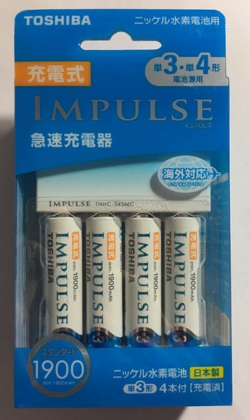

东芝 IMPULSE

第4代爱乐普白皮换壳版：规格跟白皮爱乐普完全相同，日本FDK生产。

单节电量相当于620毫安时锂电池

淘宝价格+运费19.25元/节

性能指数：9/10分

性价比指数：7/10分

另外爱乐普家族里还有索尼的镍氢电池，由于假货横行，我不建议购买！

---

2.松下EVOLTA

介绍完爱乐普镍氢电池家族后，再来聊聊爱乐普的最大竞争对手—松下EVOLTA，虽然松下收购三洋之后成为电池行业中最大的能源公司，并且于丰田汽车和特斯拉进行了大量合作，但是要知道在镍氢电池和干电池领域松下一直是被爱乐普摁在地上摩擦的对象...

事实在镍氢电池技术方面，松下的EVOLTA确实不如爱乐普，主要表现在电压稳定性、自放电率和充电循环次数上。

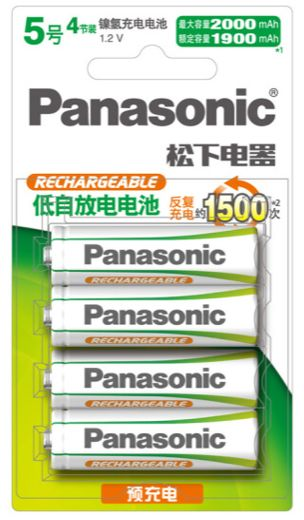

松下EVOLTA镍氢电池

松下EVOLTA本体：额定1900毫安时、自放电不如爱乐普黑皮、循环次数1500次，松下无锡工厂生产

单节电量相当于620毫安时锂电池

目前京东价格13.75元/节

性能指数：7/10分

性价比指数：8/10分

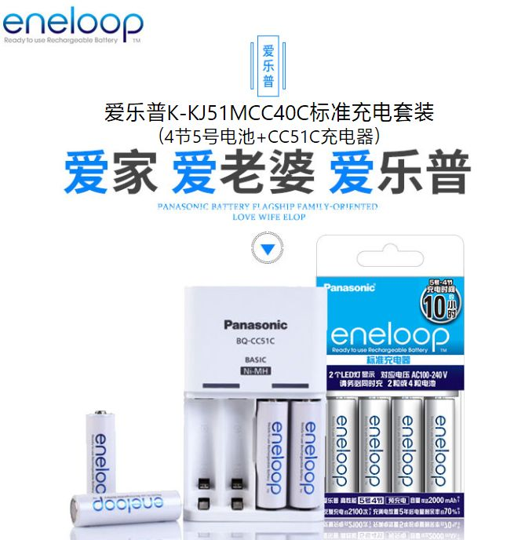

爱乐普K-KJ51MCC40C

松下EVOLTA魔改款！！！非常神奇：额定1900毫安时、自放电名义上同爱乐普白皮、循环次数2100次，松下无锡工厂生产！！！要知道松下只得到了爱乐普的品牌，爱乐普的技术和工厂都在富士通手上，所以我很好奇松下是怎么做到纸面上的相同！我看了一些测评众说纷纭，有人说电压达不到、有人说自放电是虚标，也有很多测试证明无锡产的爱乐普白皮是不如FDK产的爱乐普白皮，至少我没见到有一个说这货和FDK产爱乐普是同一个东西！

单节电量相当于620毫安时锂电池

目前京东价格约20元/节（199元减70）

性能指数：8/10分（存疑）

性价比指数：5/10分（不打折的时候真的贵）

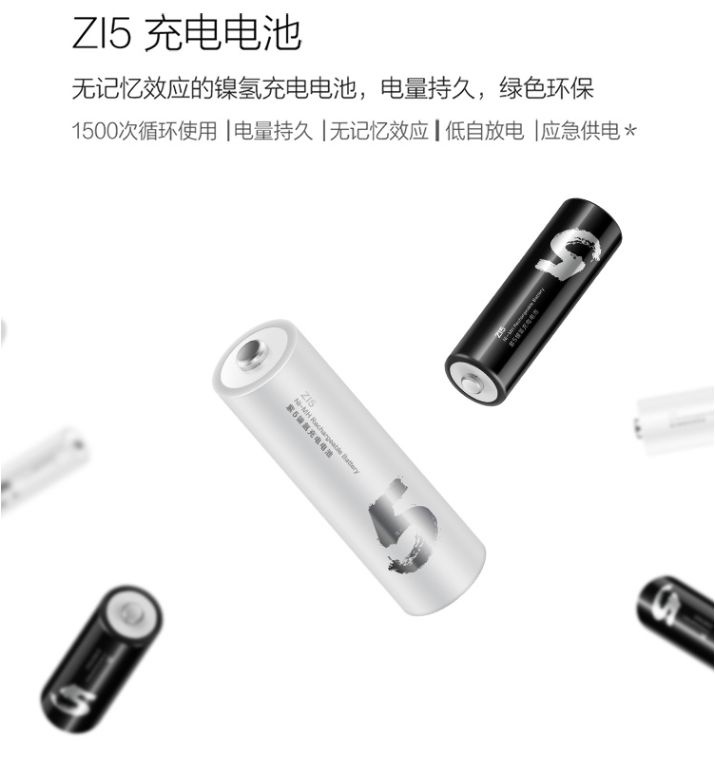

小米镍氢5号

松下EVOLTA缩水版：额定1800毫安时、自放电和EVOLTA一样、循环次数1500次，松下无锡工厂生产。

单节电量相当于580毫安时锂电池

目前京东价格9.75元/节

性能指数：6.5/10分

性价比指数：9.5/10分（这真是能方便买到的最便宜的高性能镍氢电池）

PS：谨慎购买那款镍氢电池+充电器的套装！那个电池是超霸代工。

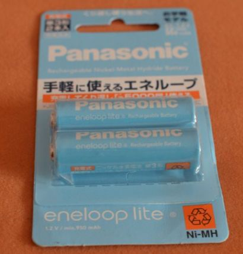

松下爱乐普lite（日）

松下EVOLTA魔改款！！！额定950毫安、循环次数5000次，这款别看印着日语在日本销售，是在松下无锡工厂生产，具体性能连日本那边都是各种质疑，详情可以去日亚看看~

单节电量相当于250毫安时锂电池

淘宝价格+运费18.5元/节

性能指数：8/10分（存疑）

性价比指数：7/10分（和真eneloop lite的东芝IMPULSE一个价）

松下EVOLTA容易买到的就这些了吧，主要是千万要认清那堆国产爱乐普，特别是别花了大把钱买了什么限量版爱乐普，结果收到一看是个换皮的无锡产EVOLTA。虽然EVOLTA和爱乐普也没有太大的差距，但是镍氢电池的王者毕竟还是爱乐普~

---

充电器推荐：

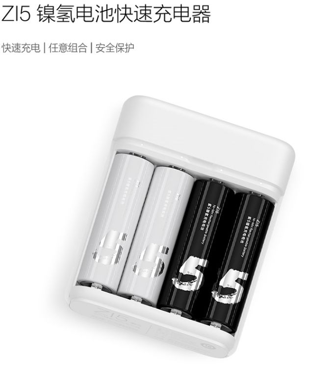

快充、防过充、小巧、兼容爱乐普和松下EVOLTA

京东售价39元

性能指数：9/10分

性价比指数：10/10分（神推荐）

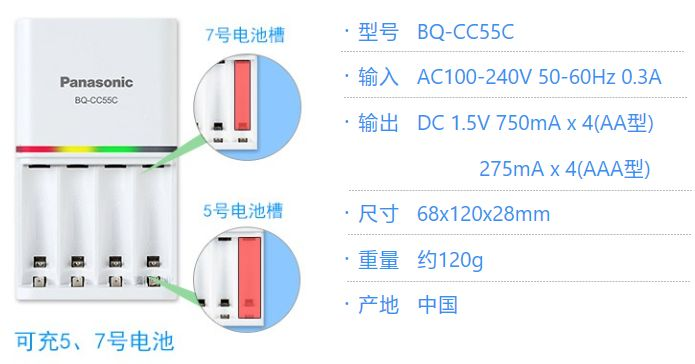

除了价格一切完美的充电器！

售价约120元

性能指数：10/10分

性价比指数：3/10分

结语：谢谢各位赏光看完，肯定有小伙伴们要问我为什么不说国内的镍氢电池品牌，一是因为我目前还没发现有值得一说的高性能电池，二是国内的大部分镍氢电池品牌性价比真心远不如松下EVOLTA家族里的部分电池，特别是像小米这样不到10元一节的电池~

如果文章反响不错，我会尝试做一下国产电池的购买指南，加上干电池！