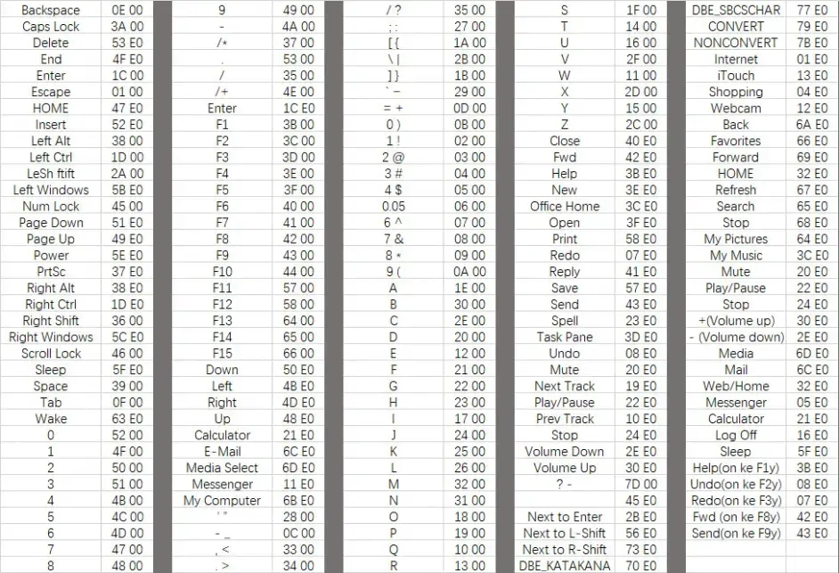

https://www.zhihu.com/question/38966565

鼠标侧键设置工具(X-Mouse Button Control) v2


通过注册表修改键盘映射（对应scancode的mark码，右边补0）

https://www.jianshu.com/p/8e46acc624db

1、进入 C:\Windows\，找到regedit.exe然后点击打开
regedit.exe
2、进入以下目录 HKEY_LOCAL_MACHINE\SYSTEM\CurrentControlSet\Control\Keyboard Layout
进入Keyboard Layout目录
3、在Keyboard Layout右击新建 -> 二进制值，名称为：Scancode Map
4、在右侧Scancode Map上右击，选择修改

```javascript
00 00 00 00 00 00 00 00    // 开头固定写法
02 00 00 00 15 00 1D E0    // 前2位：修改数量+1，如：2表示修改1个，最小为02
00 00 00 00                // 结尾固定写法
```


第二行，后8位，为一组，表示要替换的键
15 00 键盘Y，1D E0 键盘右Control
表示按下右Control会输入Y
修改二进制值

5、注销或者重启后，修改生效
如果想关闭修改，删除相关的注册表文件即可。

6、键值对照表

