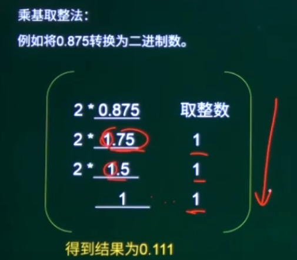
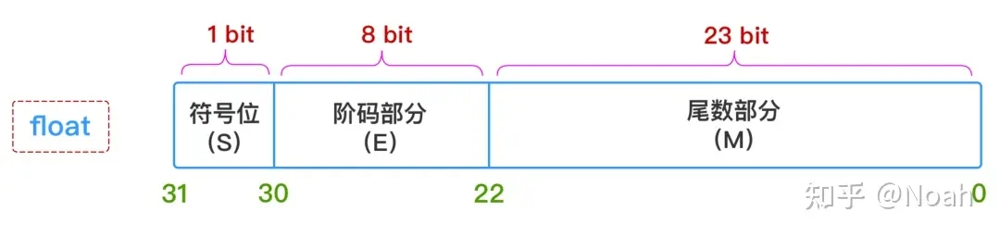

计算机硬件：运算器、控制器、储存器、输入设备、输出设备

# 进制、运算

小数 进制转换

# 浮点数表示

1. N = 尾数*基数^指数

2. N = 数符*尾数m\*2^(阶符+阶码)

   
   
   
   
   
   
   
   
# CPU

运算器、控制器

## 运算器

1. 算数逻辑单元ALU：数据的算术运算和逻辑运算
2. 累加寄存器AC (数据寄存器) :用于暂存操作数和中间运算结果并向ALU提供运算对象

## 控制器

1. 程序计数器PC：储存下一条要执行指令的地址，每执行一条指令，PC自动+1
2. 指令寄存器IR：存放正在执行的指令

# 指令

1. 指令执行方式 ：取指 分析 执行
2. 

